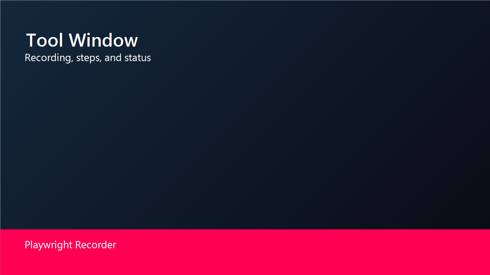

# Playwright Recorder (JetBrains)

Playwright Recorder for IntelliJ IDEA Community/Ultimate and PyCharm. Record UI flows, capture locators, and generate tests directly inside the IDE.

## Overview

The plugin runs Playwright codegen against your project and keeps the recorded steps inside the IDE. You can generate a new test file, insert steps at the current editor cursor, and refine locators with live browser highlight.

## Supported versions

- IntelliJ IDEA Community and Ultimate 2024.2+
- PyCharm 2024.2+

## Requirements

- Java 17
- Node.js project with Playwright installed (JS/TS)
- Python project with Playwright installed in the project environment (Python)

## Output behavior

- For JS/TS projects, output files use `.js` or `.ts` based on the selected target in Settings.
- For Python projects, output files use `.py`.
- The plugin writes recorded output to a file under the configured tests directory and can insert steps into the current editor.

## Feature guide

### Start Recording

1) Open the "Playwright Recorder" tool window.
2) Set the base URL (optional).
3) Click "Start Recording".
4) Interact with the target site in the Playwright browser.

### Stop Recording

1) Click "Stop Recording".
2) The tool window updates the recorded steps list.
3) The generated file is updated in the project.

### Record New Test

1) Click "Record New Test".
2) Choose JS/TS/Python if prompted (or use the default target).
3) Perform your UI flow.
4) Stop recording to create a new test file in the tests directory.

### Record at Cursor

1) Open a test file and place the cursor where you want steps inserted.
2) Click "Record at Cursor".
3) Perform your UI flow.
4) Stop recording to insert steps into the file at the cursor.

### Pick Locator

1) Click "Pick Locator".
2) Click an element in the Playwright browser.
3) The locator is shown in the tool window and can be copied or highlighted.

### Highlight Locator

1) Paste or type a locator in the Highlight field.
2) Click "Highlight".
3) The element is highlighted in the Playwright browser.

### Auto-highlight from Editor

1) Open a test file.
2) Place the caret on a locator like `page.locator("...")` or `page.getByTestId("...")`.
3) The matching element is highlighted in the browser.

### Reset Context

1) Click "Reset Context".
2) The browser is reused, but context and cached state are cleared.

### Show Browsers

1) Click "Show Browsers" to view the Playwright process and command details.

### Close All Browsers

1) Click "Close All Browsers" to terminate all recorder processes.

### Trace Viewer

1) Click "Show Trace Viewer".
2) Select a `trace.zip` file to open it in the Playwright trace viewer.

## Marketplace notes

- Add screenshots to `resources/` and reference them in the plugin description if publishing to Marketplace.
- Update `CHANGELOG.md` on releases.

## Screenshots

